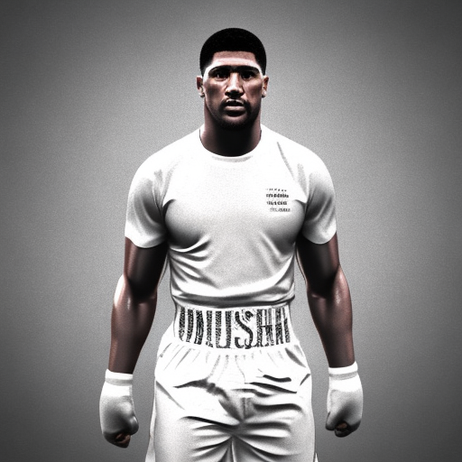

# stable-diffusion-illustration3d
Finetuning Stable Diffusion with Dreambooth to create 3D Illustration useful for designers

## THE FINETUNED MODEL IS AVALIBLE ON HUGGINGFACE: <a href="https://huggingface.co/aidystark/3Dillustration-stable-diffusion" target="_top">HUGGINGFACE FINETUNED MODEL</a>

### EXAMPLE GENERATIONS INCLUDE:
#### IT SHOULD BE NOTED THAT I DIDN'T GET QUALITY RESULTS BECAUSE MY PROMPTS WHERE VERY BASIC AND IT WAS FORMATED LIKE SO..
##### prompt = "3d illustration style rendering of anthony joshua 3d illustration style"

   

